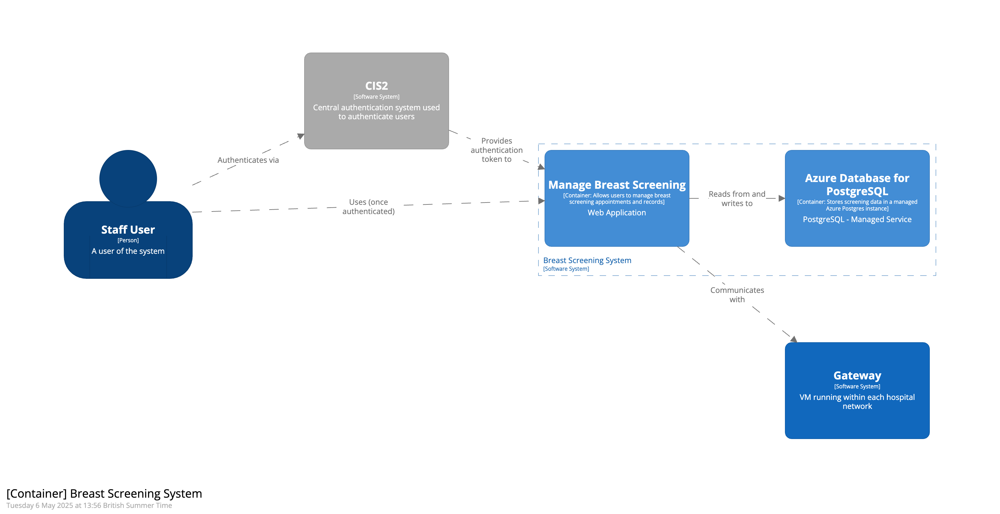

# Manage breast screening

[](https://github.com/nhsdigital/manage-breast-screening/actions/workflows/cicd-2-main-branch.yaml)

The new service is a system for managing breast screening clinics, including:

- Viewing and managing daily clinic lists
- Tracking participants through their screening journey
- Managing participant information and status

## Running the app

## Setup

To install the toolchain dependencies and setup the project, run

```shell
make config
```

This command assumes you have a few things already installed:

- [Docker](https://www.docker.com/) container runtime or a compatible tool, e.g. [Podman](https://podman.io/)
- [asdf](https://asdf-vm.com/) version manager
- [GNU make](https://www.gnu.org/software/make/) 3.82 or later

## Usage

```sh
make local
```

This will start the development instance of postgres (via docker) and serve the app at http://localhost:8000

## Local development

### Tests

To run all the tests:

```sh
make test
```

Running `make config` beforehand will ensure you have necessary dependencies installed, including the browser needed by playwright for system tests.

### Dependency management
Python dependencies are managed via [poetry](https://python-poetry.org/docs/basic-usage/).

- `poetry install` installs dependencies from the lockfile
- `poetry add` and `poetry remove` adds and removes dependencies
- `poetry run [COMMAND]` runs a command in the context of the project's virtual environment

`npm` is used to manage javascript dependencies and frontend assets.

You can run `make dependencies` to install anything that's missing after pulling new changes from GitHub.

### Frontend assets

To compile assets, run `npm run compile`

To watch for changes, run `npm run watch`

This will compile scss files to css and bundle javascripts with [rollup.js](https://rollupjs.org/).

### Postgres database

The makefile spins up a postgres DB using docker/podman.

- `make db` starts it if not running
- `make rebuild-db` rebuilds it from scratch, including seed data

#### Migrations

Database migrations are handled by [Django's database migration functionality](https://docs.djangoproject.com/en/5.2/topics/migrations/)

- `poetry run manage.py migrate` loads database migrations
- `poetry run manage.py makemigrations` generates new database migrations


### Django admin
We'll probably remove it before deploying to production, but currently Django admin is enabled.

To use it, first create a superuser

```sh
poetry run ./manage.py createsuperuser
```

Then run the app and navigate to `http://localhost:8000/admin`

## Design

The service will be deployed as a web application, backed by a postgres database with authentication provided by NHS CIS2. In addtion to these elements we will deploy a gateway application to each breast screening unit that uses the service that will be responsible for interop with local hospital systems. The gateway will be developed in a future phase of this project and is not currently under active development.



### Structure

The `manage_breast_screening` directory contains all the Django project code.

`config` is a subpackage containing the configuration. The other subpackages - such as `clinics` - are [Django apps](https://docs.djangoproject.com/en/5.1/ref/applications/). These each represent a bounded context within our overall domain of screening events. Django apps can be built with customisability and extendability in mind, and published as python packages, but we aren't doing that yet.

To generate a new app, run:

```sh
poetry run ./manage.py startapp <app_name> manage_breast_screening/`
```

## Deployment
The build pipeline builds and pushes a docker image to [Github container registry](https://docs.github.com/en/packages/working-with-a-github-packages-registry/working-with-the-container-registry). The app is deployed to an [Azure container app](https://azure.microsoft.com/en-us/products/container-apps) using terraform.

For each environment, e.g. 'dev':
1. Connect to [Azure virtual desktop](https://azure.microsoft.com/en-us/products/virtual-desktop). Ask the platform team for access with Administrator role.
1. If not present, install the following software: terraform (version 1.7.0), git, make.
    - Run a Command prompt as administrator
    - choco install terraform --version 1.7.0
    - choco install terraform git make
1. Open git bash
1. Clone the repository: `git clone https://github.com/NHSDigital/manage-breast-screening.git`
1. Enter the directory and select the branch, tag, commit...
1. Login: `az login`
1. Create the resource group: `make dev resource-group-init`. This is only required when creating the environment from scratch.
1. Deploy:
   ```shell
   make dev terraform-plan DOCKER_IMAGE_TAG=git-sha-af32637e7e6a07e36158dcb8d7ed90be49be1xyz
   ```
1. The web app URL will be displayed as output. Copy it into a browser on the AVD to access the app.

## Application secrets
The app requires secrets provided as environment variables. Terraform creates an Azure key vault and all its secrets are mapped directly to the app as environment variables. Devs can access the key vault to create and update the secrets manually.

Note [the process requires multiple steps](https://github.com/NHSDigital/dtos-devops-templates/tree/main/infrastructure/modules/container-app#key-vault-secrets) to set up an environment initially.

## Contributing

- Make sure you have `pre-commit` running so that pre-commit hooks run automatically when you commit - this should have been set up automatically when you ran `make config`.
- Consider switching on format-on-save in your editor (e.g. [Black](https://github.com/psf/black) for python)
- (Internal contributions only) contact the `#screening-manage` team on slack with any questions

### Makefile and Scripts
`scripts/` contains various scripts that can be used in the CI/CD workflows.

For more information, see the following developer guides:

- [Bash and Make](https://github.com/NHSDigital/repository-template/blob/main/docs/developer-guides/Bash_and_Make.md)
- [Scripting Docker](https://github.com/NHSDigital/repository-template/blob/main/docs/developer-guides/Scripting_Docker.md)

## Licence
Unless stated otherwise, the codebase is released under the MIT License. This covers both the codebase and any sample code in the documentation. See [LICENCE.md](./LICENCE.md).

Any HTML or Markdown documentation is [© Crown Copyright](https://www.nationalarchives.gov.uk/information-management/re-using-public-sector-information/uk-government-licensing-framework/crown-copyright/) and available under the terms of the [Open Government Licence v3.0](https://www.nationalarchives.gov.uk/doc/open-government-licence/version/3/).
